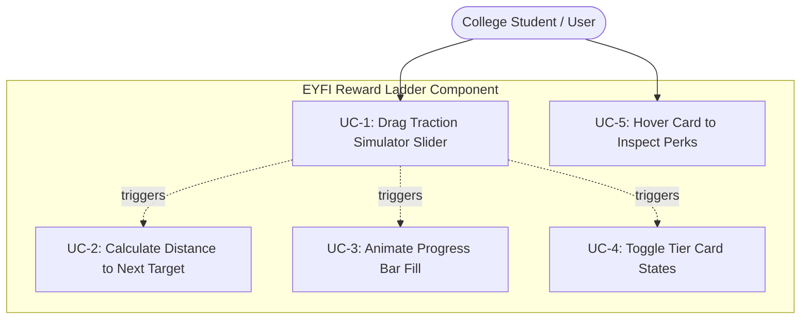
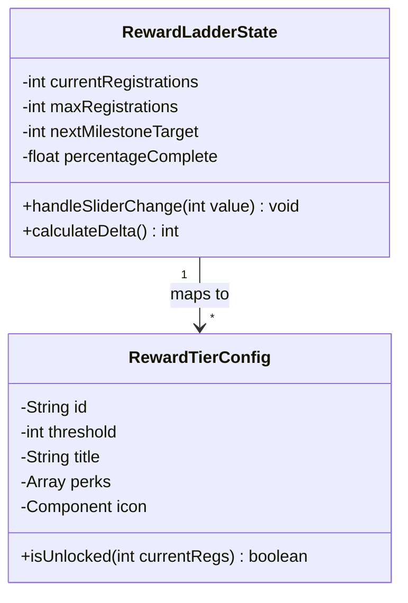
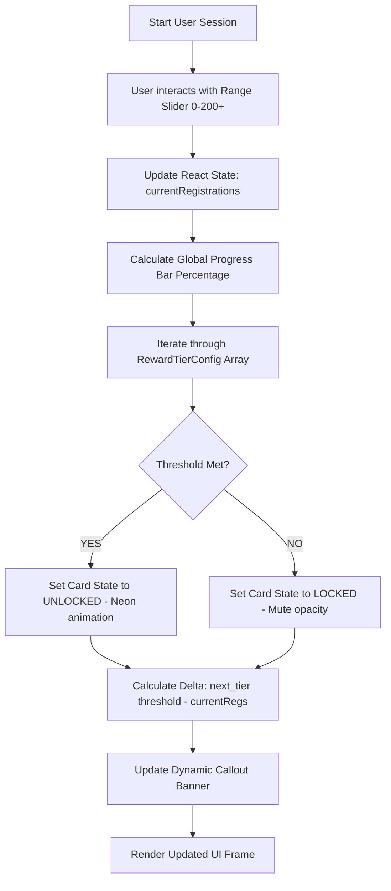
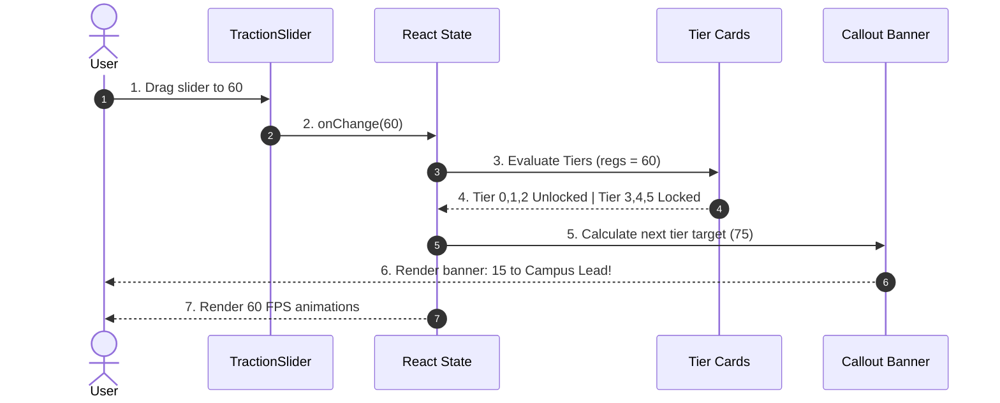

# EYFI Campus Ambassador Program – Interactive Reward Ladder
## Product Requirement & System Architecture Specification

| Metadata | Details |
| :--- | :--- |
| **Spec ID** | SPEC-001 |
| **Status** | `APPROVED` |
| **Author(s)** | Polygnan Product Engineering |
| **Owner Team** | Polygnan Growth & Core Web Engineering |
| **Target Release** | v1.1.0 (`ambassador.eyfichallenge.com`) |
| **Created Date** | 2026-07-29 |
| **Last Updated** | 2026-07-29 |
| **Feature Branch** | `feature/spec-001-interactive-reward-ladder` |

---

### 1. Problem Statement

In traditional campus ambassador programs, reward structures are often presented as static, text-heavy tables or basic graphics on a landing page (like the current v1 of `ambassador.eyfichallenge.com`).

* **Low Engagement:** College students are accustomed to highly interactive, gamified experiences (e.g., battle passes in games, streak trackers). Static tables fail to generate excitement.
* **Lack of Tangible Progression:** Without a visual representation of "how close" they are to the next tier, ambassadors lose motivation to push for those extra 5 or 10 registrations.
* **Solution:** A dynamic, interactive "Reward Ladder" widget. By utilizing a "Traction Simulator" (a draggable slider) and responsive tier cards, the system will provide micro-dopamine feedback loops, visualizing exact milestones and visually rewarding users as they "level up" their traction.

---

### 2. System Requirements

#### 2.1 Functional Requirements (FR)
* **FR-1 Interactive Traction Simulator:** A prominent UI slider allowing users to scrub between 0 and 200+ registrations to simulate their potential progress and preview rewards.
* **FR-2 Dynamic Visual Track:** A progress bar that fills dynamically corresponding to the simulator's value, connecting the milestone nodes.
* **FR-3 Stateful Tier Cards:** Each of the 6 milestones must possess three distinct states:
  * *Locked:* Muted colors, lock icon, clear "registrations needed" metric.
  * *Active/Hover:* Glow effects, expanded view of specific perks.
  * *Unlocked:* Vibrant neon accents, checkmark badge, fully visible rewards.
* **FR-4 Dynamic Callout Banner:** A text banner that calculates and displays the delta to the next tier (e.g., *"Just 15 more registrations to unlock Campus Event Grants!"*).
* **FR-5 Responsive Behavior:** The ladder must stack gracefully on mobile (vertical stepper) and expand on desktop (horizontal or grid layout).

#### 2.2 Non-Functional Requirements (NFR)
* **NFR-1 Animation Latency:** All slider drags, state changes, and hover transitions must maintain a strict 60 FPS utilizing hardware-accelerated CSS or Framer Motion.
* **NFR-2 Bundle Size:** The component must be lightweight (< 15KB gzipped), ensuring no negative impact on the landing page's Core Web Vitals.
* **NFR-3 UI Consistency:** Must align with a Gen-Z/Builder aesthetic—utilizing modern typography, glassmorphism, and high-contrast dark mode elements.

#### 2.3 Technology Stack
* **Frontend:** React (Next.js / Vite SPA), Redux Toolkit or React Context (State Management), Tailwind CSS, Framer Motion (Animations), Lucide Icons.
* **Deployment:** Vercel or Netlify for the standalone demo/prototype.

---

### 3. Product Specification

#### 3.1 Field Schema Definition
The component state relies on the following milestone configuration mapping:

| Level | Milestone | Reward Tier Title | Unlock Perks / Incentives | Iconography |
| :--- | :--- | :--- | :--- | :--- |
| **0** | Selected | Scout | Private community access + starter kit | Shield / User |
| **1** | 25 Regs | Campus Ambassador | Official Title, first swag drop, prize-linked challenge | Star / Gift |
| **2** | 50+ Regs | Campus Captain | Event grants for your campus, exclusive merch | Zap / Flame |
| **3** | 75+ Regs | Campus Lead | Mentorship access, Campus event grants | Graduation Cap |
| **4** | 100+ Regs | Polygnan Legend | Paid internship opportunities, invite to ambassador events | Briefcase |
| **5** | 200+ Regs | Founding Tier | Founding Team consideration | Crown / Trophy |

---

### 4. Software Architecture & Diagrams

#### 4.1 System Architecture Overview

```text
 ┌────────────────────────────────────────────────────────────────────────┐
 │                         REACT FRONTEND (SPA)                           │
 │  ┌──────────────────────────────┐    ┌──────────────────────────────┐  │
 │  │ Traction Simulator (Slider)  │    │ Dynamic Callout Banner       │  │
 │  └──────────────▲───────────────┘    └──────────────┬───────────────┘  │
 └─────────────────┼───────────────────────────────────┼──────────────────┘
                   │ State Update Stream               │
                   │ (React useState / Context)        ▼
 ┌─────────────────┴──────────────────────────────────────────────────────┐
 │                       REWARD LADDER STATE MACHINE                      │
 │  ┌──────────────────────────────────────────────────────────────────┐  │
 │  │ Calculates Progress % | Evaluates Thresholds | Computes Delta    │  │
 │  └──────────────┬───────────────────────────────────────────────────┘  │
 │                 ▼                                                      │
 │  ┌──────────────────────────────────────────────────────────────────┐  │
 │  │                     DYNAMIC TIER CARD GRID                       │  │
 │  │  ┌───────────────┐      ┌───────────────┐     ┌───────────────┐  │  │
 │  │  │ Tier 0 (L)    │ ───► │ Tier 1 (A)    │ ───►│ Tier 2 (U)    │  │  │
 │  │  └───────────────┘      └───────────────┘     └───────────────┘  │  │
 │  └──────────────────────────────────────────────────────────────────┘  │
 └────────────────────────────────────────────────────────────────────────┘
  * L = Locked, A = Active/Hover, U = Unlocked
```

#### 4.2 Use Case Diagram



```text
                 +-------------------------------------------------+
                 | EYFI Reward Ladder Component                    |
                 |                                                 |
                 |  +-------------------------------------------+  |
                 |  | UC-1: Drag Traction Simulator Slider      |  |
                 |  +-------------------------------------------+  |
                 |                        ^                        |
                 |                        | <<triggers>>           |
                 |  +---------------------+---------------------+  |
                 |  | UC-2: Calculate Distance to Next Target   |  |
                 |  +-------------------------------------------+  |
 College Student |                        ^                        |
    / User       |                        | <<triggers>>           |
      o -------->|  +---------------------+---------------------+  |
      |          |  | UC-3: Animate Progress Bar Fill           |  |
      |          |  +-------------------------------------------+  |
      |          |                                                 |
      |          |  +-------------------------------------------+  |
      | ---------|  | UC-4: Toggle Tier Card States (Unlock)    |  |
      |          |  +-------------------------------------------+  |
      |          |                                                 |
      |          |  +-------------------------------------------+  |
      | ---------|  | UC-5: Hover Card to Inspect Perks         |  |
                 |  +-------------------------------------------+  |
                 +-------------------------------------------------+
```

#### 4.3 Class Diagram

```text
+--------------------------------------------------+
|               RewardLadderState                  |
+--------------------------------------------------+
| - currentRegistrations: Integer                  |
| - maxRegistrations: Integer                      |
| - nextMilestoneTarget: Integer                   |
| - percentageComplete: Float                      |
+--------------------------------------------------+
| + handleSliderChange(value: Integer): Void       |
| + calculateDelta(): Integer                      |
+--------------------------------------------------+
                        ^
                        | maps to
+-----------------------+--------------------------+
|                  RewardTierConfig                |
+--------------------------------------------------+
| - id: String                                     |
| - threshold: Integer                             |
| - title: String                                  |
| - perks: Array<String>                           |
| - icon: Component                                |
+--------------------------------------------------+
| + isUnlocked(currentRegs: Integer): Boolean      |
+--------------------------------------------------+
```



#### 4.4 Activity Diagram

```text
[Start User Session]
         │
         ▼
 User interacts with Range Slider (0 - 200+)
         │
         ▼
 Update React State (currentRegistrations)
         │
         ▼
 Calculate Global Progress Bar Percentage
         │
         ▼
 Iterate through RewardTierConfig Array
         │
         ├───► Threshold Met? (currentRegs >= tier.threshold)
         │          ├── YES ──► Set Card State to UNLOCKED (Trigger neon animation)
         │          └── NO  ──► Set Card State to LOCKED (Mute opacity)
         │
         ▼
 Calculate Delta (next_tier.threshold - currentRegs)
         │
         ▼
 Update Dynamic Callout Banner ("X more to go!")
         │
         ▼
 Render Updated UI Frame
```



#### 4.5 Sequence Diagram

```text
User          TractionSlider         React State            Tier Cards             Callout Banner
 │                   │                      │                      │                     │
 │ 1. Drag to 60     │                      │                      │                     │
 │──────────────────►│                      │                      │                     │
 │                   │ 2. onChange(60)      │                      │                     │
 │                   │─────────────────────►│                      │                     │
 │                   │                      │ 3. Evaluate Tiers    │                     │
 │                   │                      │─────────────────────►│                     │
 │                   │                      │                      │ 4. Tier 0,1,2 Unlock│
 │                   │                      │                      │    Tier 3,4,5 Lock  │
 │                   │                      │◄─────────────────────│                     │
 │                   │                      │                      │                     │
 │                   │                      │ 5. Calc next (75)    │                     │
 │                   │                      │───────────────────────────────────────────►│
 │                   │                      │                      │                     │ 6. Update text:
 │                   │                      │                      │                     │    "15 to Mentorship!"
 │ 7. See animations │                      │                      │                     │
 │◄─────────────────────────────────────────│──────────────────────│─────────────────────│
```



---

### 5. Implementation Strategy

#### 5.1 Project Directory Structure
```text
eyfi-reward-ladder/
├── src/
│   ├── components/
│   │   ├── RewardLadderContainer.jsx  # Main wrapper & state holder
│   │   ├── TractionSimulator.jsx      # Draggable slider input
│   │   ├── TierCard.jsx               # Individual milestone UI
│   │   └── ProgressBar.jsx            # Connecting visual line
│   ├── data/
│   │   └── tiers.js                   # Static configuration for the 6 milestones
│   ├── App.jsx                        # Entry point for demo
│   └── index.css                      # Tailwind & custom glow classes
├── package.json
└── tailwind.config.js
```

#### 5.2 Frontend Core Implementation (React Snippets)

**A. Data Configuration (`src/data/tiers.js`)**
```javascript
export const EYFI_TIERS = [
  { threshold: 0, title: "Selected as Scout", perks: ["Private community access", "Starter kit"] },
  { threshold: 25, title: "Campus Ambassador", perks: ["Official Title", "First swag drop", "Prize-linked challenge"] },
  { threshold: 50, title: "Campus Captain", perks: ["Event grants for your campus", "Exclusive merch"] },
  { threshold: 75, title: "Campus Lead", perks: ["Mentorship access", "Campus event grants"] },
  { threshold: 100, title: "Polygnan Legend", perks: ["Paid internship opportunities", "Invite to ambassador events"] },
  { threshold: 200, title: "Founding Tier", perks: ["Founding Team consideration"] }
];
```

**B. State Management & Logic (`src/components/RewardLadderContainer.jsx`)**
```javascript
import { useState } from 'react';
import { EYFI_TIERS } from '../data/tiers';
import TierCard from './TierCard';
import TractionSimulator from './TractionSimulator';

export default function RewardLadderContainer() {
  const [regs, setRegs] = useState(0);

  const nextTier = EYFI_TIERS.find(t => t.threshold > regs) || EYFI_TIERS[EYFI_TIERS.length - 1];
  const delta = nextTier.threshold - regs;

  return (
    <div className="bg-gray-900 p-8 rounded-xl max-w-4xl mx-auto">
      <h2 className="text-white text-2xl font-bold">Your EYFI Journey</h2>
      
      {/* Target Callout */}
      {delta > 0 ? (
        <p className="text-indigo-400">Just {delta} more registrations to unlock {nextTier.title}!</p>
      ) : (
        <p className="text-emerald-400">🏆 Maximum Tier Achieved!</p>
      )}

      {/* Simulator */}
      <TractionSimulator value={regs} onChange={setRegs} />

      {/* Grid */}
      <div className="grid grid-cols-2 md:grid-cols-3 gap-4 mt-8">
        {EYFI_TIERS.map((tier) => (
          <TierCard 
            key={tier.threshold} 
            data={tier} 
            isUnlocked={regs >= tier.threshold} 
          />
        ))}
      </div>
    </div>
  );
}
```

---

### 6. Testing Plan

| Test ID | Category | Test Scenario | Input Data | Expected Outcome |
| :--- | :--- | :--- | :--- | :--- |
| **TC-01** | Functional | Default Render | Component loads, slider at 0 | Level 0 unlocks. Level 1-5 locked. Banner asks for 25 regs. |
| **TC-02** | Functional | Slider Scrubbing | User drags slider to 65 | Progress bar hits 32.5%. Levels 0, 1, 2 unlock. Banner says "10 to Campus Lead". |
| **TC-03** | UI/UX | State Transitions | User clicks/hovers on unlocked Level 3 card | Card elevates, border glows neon, reveals full perk text. |
| **TC-04** | Edge Case | Maximum Values | User drags slider to 200+ | All cards unlock. Banner shows maximum tier success message. |
| **TC-05** | Responsive | Mobile Viewport | Resize window to 375px width | Grid transforms to a vertical scrolling stack; slider touch-target remains accessible. |

---

### 7. Deployment & Integration Strategy

* **Local Prototyping:** Run via `npm run dev` (Vite) to screen-record the required video demonstration.
* **Demo Hosting (Optional):** Push to a public GitHub repository and deploy seamlessly using **Vercel** (`vercel deploy`).
* **Production Integration:** Package component module for direct inclusion into `ambassador.eyfichallenge.com` Next.js frontend.

---

### 8. Revision & Change History

| Date | Version | Author | Summary of Changes |
| :--- | :--- | :--- | :--- |
| 2026-07-29 | 1.0.0 | Polygnan Product Team | Initial SDD specification for EYFI Reward Ladder |
| 2026-07-29 | 1.1.0 | Polygnan Product Team | Added full UML/Mermaid & ASCII diagrams, test suite, and schema mappings |
